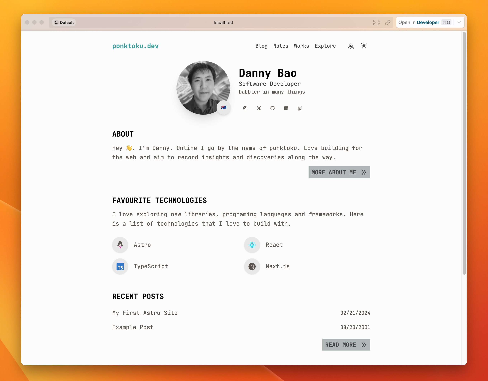

# ponktoku.dev v2

The second iteration of my personal website (ponktoku.dev) built with [Astro](https://astro.build/) and [Tailwind CSS](https://tailwindcss.com/).

## Tech Stack

- **Frontend Framework**: [Astro](https://astro.build/) - A web framework for content driven websites with hybrid, static & server side rendering
- **UI**: [Tailwind CSS](https://tailwindcss.com/) - Utility-first CSS framework
- **Hosting**: [Vercel](https://github.com/vercel/vercel) - A cloud platform for static sites and serverless functions

## 🚀 Design Notes

- Design and colours are inspired by [Hypergryph's](https://ak.hypergryph.com/#index) game [Arknights](https://www.arknights.global/).
- Content is split into two collections: `blog` and `notes`.
- Blog posts contain my insights on various topics (mainly non-technology related), while notes contain useful records and tutorials focused on development.
- The website has i18n (internationalization) functionality to toggle languages.

## 🧞 Getting Started

All commands are run from the root of the project, from a terminal:

| Command                | Action                                           |
| :--------------------- | :----------------------------------------------- |
| `pnpm install`         | Installs dependencies                            |
| `pnpm dev`             | Starts local dev server at `localhost:4321`      |
| `pnpm build`           | Build your production site to `./dist/`          |
| `pnpm preview`         | Preview your build locally, before deploying     |
| `pnpm astro ...`       | Run CLI commands like `astro add`, `astro check` |
| `pnpm astro -- --help` | Get help using the Astro CLI                     |

